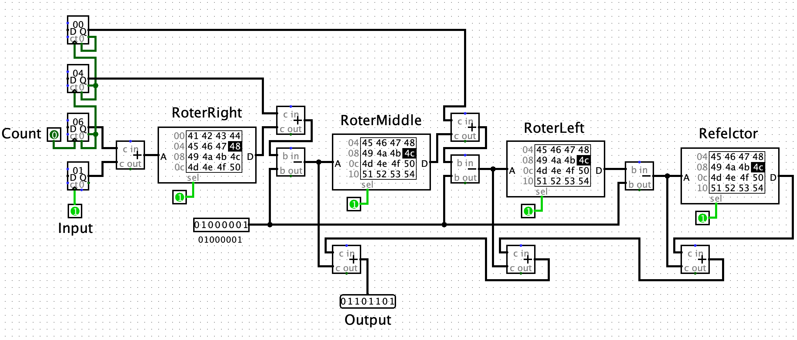

# Enigma.circ


## 동작방식
- ROM 3개 : 회전자 역할
- ROM 1개 : Reflector

```
입력값 + RoterRight + RoterMiddle + RoterLeft
```

또한 각각의 회전자는 단어가 입력될 때마다 입력된 횟수에 맞추어 적절히 회전.

## 추후에 만들어야 할 부분
```
입력값 + (RoterRight % 65) + (RoterMiddle % 65) + (RoterLeft % 65)
```
- 여러 번의 입력 대응을 위해선 나머지 연산의 구현 및 수행 필요
- Roter의 초깃값/종류 다양화
- 반사판의 종류 다양화
- Synchronous Counter 구현 및 적용